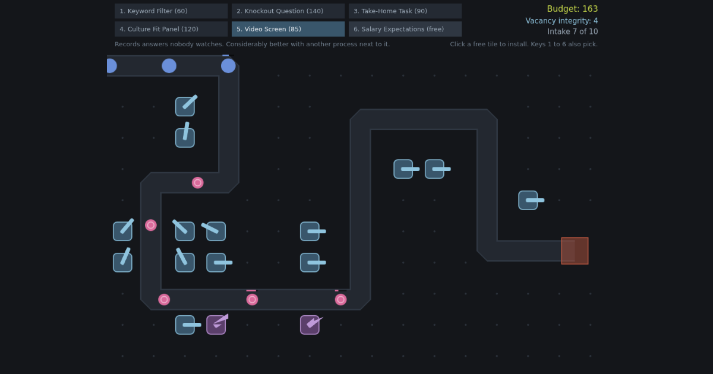

# ATS Defence

A browser tower defence game where you are the applicant tracking system, and the applicants are the problem.

**[Play it](https://ats.spencerstern.com)**



## The idea

Applicants advance along a path towards a single open vacancy. You place screening mechanisms to reject them before they arrive. Anyone who gets through costs you a life, because somebody then has to read their application properly and might hire them.

A run is ten intakes long and the vacancy tolerates ten arrivals. Most of the screening budget comes back as rejections, so anyone who walks past a tower has also taken with them the money that would have bought the next one.

The joke is that you are the one doing the rejecting, and that the tools are recognisably the ones real systems use. Keyword Filter. Knockout Question. Take-Home Task. Culture Fit Panel. Video Screen. Salary Expectations, which is free to ask and only works once.

The applicants know the game too. The Keyword Stuffer is immune to keyword matching. The Referral starts a third of the way down the path. The Boomerang comes back at the end of the intake whether you rejected it or not.

## Three ways to run a vacancy

**Classic intake** is the game above. One path in, walked in single file, towers beside it.

**Open advert** is what happens when the vacancy gets shared around. There is no path: applicants arrive across the whole left edge and make their own way to the desk, fanning out where the ground is open and squeezing through where it narrows. Towers go anywhere, because there is no corridor to stand beside, and choosing where is now about how much of the crowd a tower can see rather than which corner it can cover.

It also gives the applicants something back. Enough of them crowded round a screening process wears it down until it is suspended pending review, and it is nine seconds before it comes back, at full integrity, having learned nothing. A Graduate on its own cannot manage it. A Referral very nearly can, because it knows somebody.

**Back channel** is what happens when nobody uses the portal at all. There is no route on the board, advertised or otherwise: they come in across the left edge and work out their own way to the desk, and every screening process installed is something to be walked round rather than something to be walked past. Nothing blocks anybody, so there is no maze to build. A tower makes the ground it covers expensive, applicants take the cheapest way in rather than the shortest, and the question stops being where to stand and becomes what the cheapest way in is going to cost.

How much any of them minds is a property of the type, which is where most of the mode lives. The Graduate applies to everything and walks at the desk in a straight line through whatever is in the way. The Overqualified has seen a knockout question before and goes a very long way round one. The Keyword Stuffer minds the rest of the board as much as anybody and strolls straight through a Keyword Filter, because a Keyword Filter has nothing to say to it. And Salary Expectations, which lays down no threat at all, is the one thing nobody routes round: it goes on the ground they have just been pushed onto.

**One-click apply** is the phone board, and it is the only one nobody picks. A phone is routed to it by the size of its screen, because the other three are a landscape board with a six button palette and a phone is the wrong shape for all of it. There is no path, no placement and no input at all during an intake: one screening process fixed dead centre, applicants converging on it from every direction, and a turret that turns to whoever has least walking left. Everything the player decides happens between intakes, where the process is offered exactly two improvements and can have one of them.

The joke it tells is the one the other three cannot. The other boards are a system somebody is operating. This one is a system running on its own while somebody watches, and the only question it ever asks is which of two ways it should be more thorough.

The four modes keep separate leaderboards. They send different numbers of applicants at boards of a different shape, so a rating from one is not a rating from the others.

## Installing it

It is installable. A browser that offers it will put it on a home screen or in an app list, where it opens on its own without the browser chrome around it, which is worth most on the phone board.

It also plays with no signal, because nothing in a run has ever needed the network: the art, the sounds, the waves, the cards and the music are all in the build. What does need a connection is the leaderboard, and it says so rather than hanging. A run played offline is a real run that no board will ever hear about.

## Running it

```bash
npm install
npm run dev
```

Requires Node 22. `npm run build` produces `dist`, which is what Netlify publishes.

Two optional environment variables, neither of them secret, both documented in `.env.example`. Everything that is a secret lives in the Netlify environment and never in a `VITE_` variable, because Vite inlines those into the client bundle.

## How it is built

| Concern | Choice |
| --- | --- |
| Engine | Phaser 4 |
| Build | Vite |
| Language | Vanilla JS |
| Hosting | Netlify |
| Backend | Supabase, behind Netlify functions |
| Experiments | GrowthBook |

**Balance lives in data.** `src/config/waves.js`, `towers.js`, `applicants.js`, `game.js`, `mobile.js`, `upgrades.js` and `modes.js` are plain exported objects with no logic in them, so tuning never means touching the game loop. Two of the four boards are a hardcoded list of waypoints, and the crowd is not the exception it looks like: a waypoint there carries a spread, each applicant walks their own copy of the line displaced by their share of it, and a horde is what that looks like from the outside.

The third board does have pathfinding, which this file said for a long time it never would. It earned the exception by being the only way to tell the joke it exists for, and it kept the rule that mattered: what it varies is still data. How frightening each tower is and how much each applicant type minds are numbers in `towers.js` and `applicants.js`, `services/routing.js` is the only file that knows what to do with them, and the modes that have no field on them never find out any of it is there.

The fourth needs neither, and that is the whole of its board data: a centre, a ring to arrive on and a radius to arrive at. A walk is a straight line inwards, which is a path with one segment in it, so `entities/Applicant.js` carries it with no fork, no subclass and no edit, and the file three tuned modes depend on was not touched to add a fourth. Its wave list and its card pool are tuned against `tools/simulate-mobile.mjs`, which plays the board a few thousand times without a browser, because a design whose difficulty lives in the interaction between a card pool and a wave curve cannot be tuned by one person playing it twice.

**Copy lives in one file.** Every user-facing string is in `src/content/copy.js`.

**The browser holds no database key.** Both the leaderboard and the analytics collector go through Netlify functions holding the service role key. The tables have row level security on with no policies at all, so the anonymous role can do nothing. Submitted scores are checked server side against a ceiling recomputed from the same wave data the game plays from.

## Instrumentation

Fifteen events, seven global properties on every one of them, all landing in Supabase. The intent was to answer specific questions rather than to collect telemetry in general: where players quit, whether the difficulty curve is right, whether they replay after losing, which towers are dead weight.

The fifteenth, `upgrade_offered`, is the phone board's only player decision, and it is the one event that records something declined as well as something done. `tower_placed` has no slot for a refusal because on the desktop boards everything is always on offer. A two of six draw makes "which of these is dead weight" answerable only as take rate against offer rate, and a card rarely taken may simply be rarely offered. The queries are in `docs/upgrade-cards.sql`.

The seventh global is `mode`, and it arrived with the second mode rather than with the spec. Every question in the list above has four answers now, and an event that does not say which game it came from cannot tell them apart. It is a property rather than a fourteenth event because it is not a thing that happens: it is a fact about the run the other thirteen are already reporting. The queries in `docs/` now read one mode at a time, defaulting to classic, since wave five means a different intake in each and the boards are separate. The tower usage fixture carries five open advert runs that must not reach any of its expected figures, and each places the one tower no classic run in it ever places: strip the filter and the deadest tower in the game climbs to a fifth of all runs, which is the finding the filter exists to protect.

It has already earned its keep twice. The wave curve for the balancing pass was read off these events rather than guessed at, and the first real run through the collector exposed a bug in the abandonment tracking that would otherwise have quietly ruined the experiment's secondary metric.

It has also failed once, for two days, without saying so. Two migrations adding columns to the events table were never applied to the production database, so every insert named columns that did not exist and the collector recorded nothing from 4 to 6 August. The leaderboard was unaffected and kept taking scores, so the game looked healthy throughout, and events go out through `sendBeacon`, which hands the browser no response to notice. There is now a daily check that asks the one question quiet traffic cannot fake: has anybody finished a run whose events never arrived. The reasoning, and the limitation that it only fires once somebody submits a score, are in `netlify/functions/health.mjs`. It runs as a scheduled workflow next to the one that pings the database twice a week, since a free tier Supabase project pauses itself after seven quiet days and a paused database records nothing either.

The dead weight question has its own queries in `docs/tower-usage.sql`: reach rather than raw placements, since the one trap is free and single use and would otherwise top every count, and a separate query for whether an unused tower is unwanted or merely unaffordable, which have opposite fixes. It also contains the query for which towers win games, together with the reason that query cannot answer it.

The other five questions are in `docs/leaderboard-and-players.sql`, and most of that file leans on the leaderboard, because a board row carries the id of the run that produced it. An entry is therefore a whole run rather than a name and a number: the towers it placed, the wave it died on, how long it took. It is also where the question about whether the board drives replays had to be reworded. The panel emits its view event whenever it renders rows, on both screens, so nearly every game over produces one, and comparing players who saw the board against players who did not compares working networks with broken ones. What a player actually chooses on that screen is whether to submit, and what the board decides is whether their name went on it, so those are what the queries compare instead. `docs/leaderboard-and-players-check.sql` is the fixture the arithmetic was checked against before any of it met real rows, with six deliberate traps in it.

One experiment runs at launch, on whether a busier first wave reduces early abandonment. The analysis was written down beforehand, including the part where the sample size is probably too small to conclude anything. See `docs/experiment-starting-difficulty.md`, and `docs/experiment-starting-difficulty.sql` for the queries that produce the numbers.

GrowthBook does the bucketing and nothing else. There is no data source behind it, so the results are read out of Supabase rather than off its dashboard. The thirteenth event, `experiment_viewed`, is GrowthBook's own record that a player was bucketed, which is the one thing the arm string on every other event cannot tell you: a genuine control assignment and a run that never reached GrowthBook look identical otherwise. Connecting it to Supabase as a data source is written up in `docs/growthbook-datasource.md`, including why it stays disconnected until the experiment has been read out: a results page that recomputes nightly is continuous peeking at an analysis that was pre-registered to happen once.

## Platform

Desktop, tablet and phone. A phone gets a different game rather than a smaller one.

Placing a tower means seeing what it would take before committing to it, which a mouse does by hovering. A finger cannot hover, so on a touchscreen the two halves become pressing and lifting: the preview follows the drag and the tower lands where the finger comes off. It is drawn above the finger rather than under it, since a fingertip covers most of a cell. Which route an event takes is decided per event rather than once at boot, so a laptop with a touchscreen works either way, and both routes end in the same placement code.

The gate is still the size of the screen and nothing else: 900 by 600. What has changed is what sits on the other side of it. A tablet clears it and renders the fixed 1024 by 768 board at close to its own size. No phone clears it in either orientation, and a phone used to get an honest message saying so. It now gets the fourth mode, one-click apply, which is a portrait board built for the shape rather than the landscape board shrunk to fit it: one screening process fixed in the middle, applicants converging on it from every direction, nothing to place, and the only decision a choice between two cards between intakes. `?shape=phone` and `?shape=desktop` override the gate in both directions, which is how either board gets reviewed on a deploy preview from whatever is to hand.

Two honest refusals are left and neither is about the size of the screen. A browser that cannot give the board a WebGL context gets a message rather than a blank canvas, and a phone turned on its side gets one too, because the portrait board letterboxed into a landscape strip is exactly the broken layout the message exists to beat. The landscape one is a veil over the page rather than a screen instead of it, so a run survives being turned sideways and is still there on the way back.

The leaderboard takes a tablet too, which it did not at first. A soft keyboard only opens for a real form field, and only when the player's own tap lands on it, so there is an invisible one sat exactly over the name box the game draws. It filters what it is given by the same rules the key presses went through, hands the text back and is never seen: the box, the letters and the caret are all still drawn on the canvas. It is only built where the pointer is coarse, so the keyboard route is untouched, and the game is lifted clear while the field has focus, since the keyboard covers the half of the screen the box sits in.

## Art

Sprites from [Kenney](https://kenney.nl)'s Tower Defense (top-down) pack, CC0. Towers, applicants, traps and the two hit effects are his. The board itself is not: the path, the grid, the vacancy and the range rings are all still drawn at runtime, because the pack is bright cartoon grass and this game is meant to look like a piece of software nobody enjoys using.

The art is greyscale on disk and tinted per type at runtime, so a tower's colour is a number in `towers.js` rather than a file, and one sprite can serve two applicants. Which sprite anything uses is data too. `art.js` lists the files, `BootScene` loads them, and `towers.js` and `applicants.js` name the one they want.

Every file was cropped, most were greyscaled and the turrets were turned a quarter turn. `public/assets/kenney/ATTRIBUTION.md` records what was done to each one and which original it came from.

## Introductions

The first time an applicant type turns up, it gets a card under the HUD with its
name, its one awkward habit and a short looping animation of it. The Graduate
throws a cap that does not come back. The Career Changer's CV is still unrolling
when the frame runs out. The Overqualified stacks qualifications past the
ceiling, the Keyword Stuffer fills a page in until there is nothing left on it to
read, the Referral's barrier lifts well before they reach it, and the Boomerang
comes back. The card does not stop the wave, since a type usually arrives in the
middle of one.

A found clip would have been funnier and was not an option: this repository is
public, every other asset in it is CC0, and stock footage of somebody's actual
graduation is neither ours to ship nor especially kind to the person in it. So
`tools/make-intros.mjs` draws all six out of circles and rectangles, using Node
built-ins and no dependency, and writes them out as sprite strips. They are
greyscale like the rest of the art and tinted with the applicant's own colour, so
the card and the thing walking down the path are recognisably the same person.
See `public/assets/intros/README.md`.

## Sound

Six clips: a stamp when a process is installed, a flat two tone blip for a
rejection, a low buzz when somebody reaches a human, notes up when applications
open and down when the intake is screened, and a dead thud when the budget will
not stretch to it. On by default, at a volume set for a browser tab next to
other things, and turned off by the toggle in the corner of the HUD or the M
key. The choice is remembered.

None of it is recorded. `tools/make-sounds.mjs` draws all six out of sine waves
and envelopes, using Node built-ins and no dependency, which means each sound is
a readable recipe rather than a binary and the whole set is 68kB. Levels and the
gap between repeats are data in `src/config/audio.js`, on the same principle as
the balance. See `public/assets/audio/README.md`.

## Licence

MIT.
